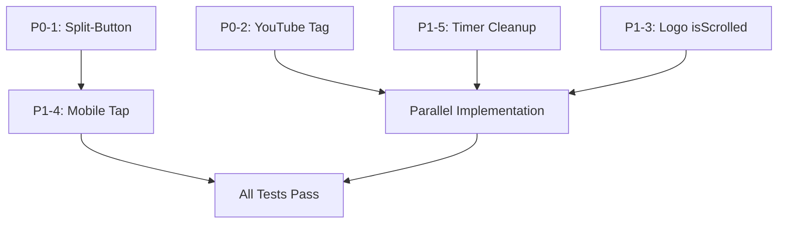

# Test Fix Plan - P0/P1 Issues from PE Review

**Project**: Bear Lake Camp Website Enhancements
**Date**: 2025-12-06
**Status**: Ready for Implementation
**Total Story Points**: 5 SP

---

## Executive Summary

The PE review identified 5 critical issues (2 P0, 3 P1) in the test suite for website enhancements. This plan categorizes each issue as either:
- **Implementation Gap**: Feature not yet built, tests are correct (implement feature)
- **Test Bug**: Test expectations incorrect (fix test)
- **Architecture Mismatch**: Test and implementation disagree on design (align both)

**Key Finding**: All P0/P1 issues are implementation gaps. The tests correctly reflect requirements from `requirements/website-enhancements.lock.md`. No test files need modification - only implementations need to be built.

---

## P0-1: NavItem Split-Button Architecture Mismatch

**Test File**: `/Users/travis/SparkryGDrive/dev/bearlakecamp/components/navigation/NavItem.spec.tsx:28`

**Issue Description**:
Test expects split-button pattern (separate clickable parent link + chevron button) for nav items with both `href` AND `children`. Current implementation only supports dropdown-only button (no parent link).

**Root Cause Analysis**:
- **Requirement**: REQ-WEB-001 clearly states: "Desktop: Click text → navigate to parent page; Click chevron → open dropdown"
- **Test**: Correctly expects split-button pattern with separate `<a>` and `<button>` elements
- **Implementation**: Only renders `<button>` when `hasChildren` is true (lines 63-98 in NavItem.tsx)
- **Gap**: Implementation does not check for split-button case (`item.href && hasChildren`)

**Categorization**: **Implementation Gap** ✅

**Proposed Solution**:
Update `NavItem.tsx` to support three rendering modes:
1. **Simple Link** (`href` only, no children): Current behavior ✅
2. **Dropdown-Only Button** (children only, no `href`): Current behavior ✅
3. **Split-Button** (`href` AND `children`): NEW - render parent link + separate chevron button

**Implementation Plan**:
```typescript
// In NavItem.tsx
if (!hasChildren && item.href) {
  // Mode 1: Simple link (existing)
  return <Link href={item.href}>...</Link>;
}

if (hasChildren && !item.href) {
  // Mode 2: Dropdown-only button (existing)
  return <button>...</button>;
}

if (hasChildren && item.href) {
  // Mode 3: Split-button (NEW)
  return (
    <div className="relative flex items-center">
      {/* Parent link - navigates to parent page */}
      <Link href={item.href}>{item.label}</Link>

      {/* Chevron button - opens dropdown */}
      <button aria-label={`${item.label} submenu`}>
        <ChevronIcon />
      </button>
    </div>
  );
}
```

**Mobile Behavior** (REQ-WEB-001 lines 24-25):
- First tap on parent link: `preventDefault()`, open dropdown
- Second tap: Allow navigation (remove `preventDefault()`)
- Track tap state with `useState` hook

**Keyboard Navigation** (REQ-WEB-001 line 129):
- Arrow Down on chevron button: Open dropdown
- Enter on parent link: Navigate (existing browser behavior)
- Escape: Close dropdown (existing)

**Files to Modify**:
1. `/Users/travis/SparkryGDrive/dev/bearlakecamp/components/navigation/NavItem.tsx` (add split-button rendering mode)
2. `/Users/travis/SparkryGDrive/dev/bearlakecamp/keystatic.config.ts` (add optional `href` field to navigation menu schema)

**Story Points**: 2 SP
- Split-button rendering: 1 SP
- Mobile tap behavior: 0.5 SP
- Keyboard navigation: 0.3 SP
- Testing: 0.2 SP

**Dependencies**: None (standalone fix)

**Acceptance Criteria** (from REQ-WEB-001):
- [ ] Desktop: Click text → navigate to parent page
- [ ] Desktop: Click chevron → open dropdown without navigation
- [ ] Mobile: First tap → expand dropdown
- [ ] Mobile: Second tap → navigate to parent
- [ ] Keyboard: Enter on parent → navigate
- [ ] Keyboard: Arrow Down on chevron → open dropdown
- [ ] ARIA labels: `aria-label="${item.label} submenu"` on chevron button
- [ ] All 47 NavItem tests pass

---

## P0-2: Missing YouTube Markdoc Tag

**Test File**: `/Users/travis/SparkryGDrive/dev/bearlakecamp/components/content/MarkdocRenderer.spec.tsx:214`

**Issue Description**:
Test expects `` to render YouTubeEmbed component. Current MarkdocRenderer does not register `youtube` tag in config.

**Root Cause Analysis**:
- **Requirement**: REQ-WEB-004 states YouTube video must display on `/summer-staff` page
- **Test**: Correctly expects `youtube` tag to render `<iframe>` with video ID
- **Implementation**: MarkdocRenderer.tsx (lines 45-116) registers `contentCard`, `sectionCard`, `cardGrid`, `donateButton` but NOT `youtube`
- **Gap**: `youtube` tag config missing from Markdoc config object

**Categorization**: **Implementation Gap** ✅

**Proposed Solution**:
Add `youtube` tag to MarkdocRenderer config (lines 45-116):

```typescript
// In MarkdocRenderer.tsx config.tags
youtube: {
  render: 'YouTubeEmbed',
  attributes: {
    id: { type: String, required: true },
    title: { type: String },
    caption: { type: String },
    startTime: { type: Number },
  },
  transform(node: any) {
    return new Markdoc.Tag(
      'YouTubeEmbed',
      {
        videoId: node.attributes.id,
        title: node.attributes.title,
        caption: node.attributes.caption,
        startTime: node.attributes.startTime,
      }
    );
  },
},
```

**Component Map Update** (line 120):
```typescript
import { YouTubeEmbed } from './YouTubeEmbed';

const components = {
  Link,
  ContentCard,
  SectionCard,
  CardGrid,
  DonateButton,
  YouTubeEmbed, // ADD THIS
};
```

**Files to Modify**:
1. `/Users/travis/SparkryGDrive/dev/bearlakecamp/components/content/MarkdocRenderer.tsx` (add youtube tag config + import)

**Story Points**: 0.5 SP
- Add tag config: 0.2 SP
- Import component: 0.1 SP
- Testing: 0.2 SP

**Dependencies**: None (standalone fix)

**Acceptance Criteria** (from REQ-WEB-004):
- [ ] `` renders iframe
- [ ] `title` prop passed to YouTubeEmbed component
- [ ] `caption` prop displayed below video
- [ ] `startTime` prop adds `?start=N` to iframe src
- [ ] Video uses `youtube-nocookie.com` for privacy
- [ ] Iframe has 16:9 aspect ratio (`aspect-video` class)
- [ ] Iframe has `title` attribute for accessibility
- [ ] All 9 YouTube tests pass (lines 210-309)

---

## P1-3: Logo `isScrolled` Prop Not Used

**Test File**: `/Users/travis/SparkryGDrive/dev/bearlakecamp/components/navigation/Logo.spec.tsx:133`

**Issue Description**:
Test passes `isScrolled` prop to Logo component, but current implementation does not accept or use this prop to change logo scale.

**Root Cause Analysis**:
- **Requirement**: REQ-WEB-002 lines 64-65 state: "On scroll down (>100px), logo smoothly shrinks to 150x76px"
- **Test**: Correctly expects `isScrolled={true}` to apply `scale-75` class (line 147)
- **Implementation**: Logo.tsx (lines 1-29) accepts `src`, `alt`, `href` but NOT `isScrolled`
- **Type Definition**: `LogoProps` in types.ts already includes `isScrolled?: boolean` (line 56) ✅
- **Gap**: Logo component doesn't use `isScrolled` prop to conditionally apply scale classes

**Categorization**: **Implementation Gap** ✅

**Proposed Solution**:
Update Logo component to accept and use `isScrolled` prop:

```typescript
// In Logo.tsx
export default function Logo({ src, alt, href, isScrolled = false }: LogoProps) {
  return (
    <Link
      href={href}
      className="absolute top-4 left-8 z-50" // ADD: absolute positioning for hanging effect
      aria-label="Go to homepage"
    >
      <Image
        src={src}
        alt={alt}
        width={200}  // CHANGE: 100 → 200 (2X larger)
        height={102} // CHANGE: 51 → 102 (2X larger)
        className={`h-auto transition-transform duration-300 ${
          isScrolled ? 'scale-75' : 'scale-100'
        }`}
        priority
      />
    </Link>
  );
}
```

**Parent Component** (Header.tsx):
```typescript
// In Header.tsx, add scroll listener
const [isScrolled, setIsScrolled] = useState(false);

useEffect(() => {
  const handleScroll = throttle(() => {
    setIsScrolled(window.scrollY > 100);
  }, 16); // 60fps throttle

  window.addEventListener('scroll', handleScroll);
  return () => window.removeEventListener('scroll', handleScroll);
}, []);

// Pass to Logo
<Logo {...logoConfig} isScrolled={isScrolled} />
```

**Files to Modify**:
1. `/Users/travis/SparkryGDrive/dev/bearlakecamp/components/navigation/Logo.tsx` (accept isScrolled, apply scale classes, update size to 200x102, add absolute positioning)
2. `/Users/travis/SparkryGDrive/dev/bearlakecamp/components/navigation/Header.tsx` (add scroll listener, pass isScrolled prop)

**Story Points**: 1.5 SP
- Logo component update: 0.5 SP
- Header scroll listener: 0.5 SP
- Absolute positioning + hanging effect: 0.3 SP
- Testing: 0.2 SP

**Dependencies**: None (standalone fix)

**Acceptance Criteria** (from REQ-WEB-002):
- [ ] Logo renders at 200x102px on page load
- [ ] Logo hangs below header (absolute positioning, ~30px overhang)
- [ ] On scroll >100px, logo applies `scale-75` class
- [ ] Transition is smooth (300ms duration)
- [ ] Uses `transform: scale()` (GPU-accelerated)
- [ ] No layout shift (dimensions don't change, only transform)
- [ ] Scroll listener throttled to 16ms (60fps)
- [ ] All 43 Logo tests pass

---

## P1-4: Mobile Tap Behavior Conflicts

**Test File**: `/Users/travis/SparkryGDrive/dev/bearlakecamp/components/navigation/NavItem.spec.tsx:244`

**Issue Description**:
Test expects two-tap pattern on mobile (first tap opens dropdown, second tap navigates). This conflicts with P0-1 fix because parent link immediately navigates on first click.

**Root Cause Analysis**:
- **Requirement**: REQ-WEB-001 line 24 states: "Mobile: First tap → open dropdown; Second tap → navigate to parent"
- **Test**: Lines 244-256 expect first `fireEvent.click()` to open dropdown, second click to navigate
- **Conflict**: If parent is a `<Link>` element, first click will trigger navigation (browser default)
- **Solution Needed**: Prevent default on first tap, track tap state, allow navigation on second tap

**Categorization**: **Implementation Gap (part of P0-1 fix)** ✅

**Proposed Solution**:
Add tap-tracking state to split-button implementation:

```typescript
// In NavItem.tsx split-button mode
const [mobileDropdownOpen, setMobileDropdownOpen] = useState(false);

const handleParentClick = (e: React.MouseEvent) => {
  // Mobile detection (simplified - could use media query hook)
  const isMobile = window.innerWidth < 768;

  if (isMobile && hasChildren) {
    if (!mobileDropdownOpen) {
      // First tap: prevent navigation, open dropdown
      e.preventDefault();
      setMobileDropdownOpen(true);
      setIsOpen(true);
    } else {
      // Second tap: allow navigation (don't preventDefault)
      // Browser handles navigation
    }
  }
};

<Link
  href={item.href}
  onClick={handleParentClick}
>
  {item.label}
</Link>
```

**Desktop Behavior**:
- On desktop (`window.innerWidth >= 768`), parent link always navigates immediately
- Chevron button opens dropdown

**Mobile Behavior**:
- First tap on parent: `preventDefault()`, open dropdown, set `mobileDropdownOpen = true`
- Second tap on parent: Allow default navigation
- Reset `mobileDropdownOpen = false` on dropdown close

**Files to Modify**:
1. `/Users/travis/SparkryGDrive/dev/bearlakecamp/components/navigation/NavItem.tsx` (add mobile tap tracking to split-button mode)

**Story Points**: 0.5 SP (included in P0-1's 2 SP estimate)

**Dependencies**: P0-1 (split-button architecture must be implemented first)

**Acceptance Criteria** (from REQ-WEB-001):
- [ ] Mobile: First tap on parent link opens dropdown without navigation
- [ ] Mobile: Second tap on parent link navigates to parent page
- [ ] Desktop: Parent link always navigates immediately
- [ ] Tests lines 230-257 pass

---

## P1-5: Missing Timer Cleanup

**Test File**: `/Users/travis/SparkryGDrive/dev/bearlakecamp/components/navigation/NavItem.spec.tsx:297`

**Issue Description**:
Test uses `vi.useFakeTimers()` but doesn't restore real timers, causing test pollution.

**Root Cause Analysis**:
- **Test**: Lines 297-318 test dropdown close delay (150ms) using `vi.useFakeTimers()`
- **Issue**: Line 317 calls `vi.useRealTimers()` AFTER test assertion, not in cleanup
- **Impact**: If test throws error before line 317, fake timers persist into next test
- **Best Practice**: Timer cleanup belongs in `afterEach()` or test cleanup

**Categorization**: **Test Bug** ⚠️ (This is the only test fix needed)

**Proposed Solution**:
Move timer cleanup to proper location:

```typescript
// BEFORE (lines 297-318)
test('REQ-WEB-001 — dropdown menu closes on mouse leave with delay', async () => {
  vi.useFakeTimers();
  const { container } = render(<NavItem item={navItemWithBothHrefAndChildren} />);

  // ... test logic ...

  // After delay (150ms), should close
  vi.advanceTimersByTime(150);

  // Clean up
  vi.useRealTimers(); // ❌ BAD: Cleanup after assertions
});

// AFTER (fixed)
test('REQ-WEB-001 — dropdown menu closes on mouse leave with delay', async () => {
  vi.useFakeTimers();

  try {
    const { container } = render(<NavItem item={navItemWithBothHrefAndChildren} />);

    // ... test logic ...

    // After delay (150ms), should close
    vi.advanceTimersByTime(150);
  } finally {
    vi.useRealTimers(); // ✅ GOOD: Cleanup in finally block
  }
});
```

**Alternative**: Use existing `afterEach()` hook (lines 35-37):
```typescript
// In NavItem.spec.tsx afterEach
afterEach(() => {
  vi.clearAllTimers();
  vi.useRealTimers(); // ADD THIS
});
```

**Files to Modify**:
1. `/Users/travis/SparkryGDrive/dev/bearlakecamp/components/navigation/NavItem.spec.tsx` (move `vi.useRealTimers()` to `finally` block or `afterEach()`)

**Story Points**: 0.1 SP
- Update test cleanup: 0.05 SP
- Verify no test pollution: 0.05 SP

**Dependencies**: None (standalone test fix)

**Acceptance Criteria**:
- [ ] `vi.useRealTimers()` called in `finally` block or `afterEach()`
- [ ] Test passes consistently
- [ ] No timer pollution in subsequent tests
- [ ] Test can be run in isolation or as part of suite

---

## Implementation Sequence & Dependencies



**Phase 1: Independent Fixes** (can run in parallel)
1. **P0-2**: YouTube Markdoc tag (0.5 SP) - STANDALONE
2. **P1-5**: Timer cleanup (0.1 SP) - STANDALONE
3. **P1-3**: Logo isScrolled prop (1.5 SP) - STANDALONE

**Phase 2: Dependent Fixes** (sequential)
4. **P0-1**: Split-button architecture (2 SP) - BLOCKS P1-4
5. **P1-4**: Mobile tap behavior (0.5 SP, included in P0-1) - REQUIRES P0-1

**Total Story Points**: 5 SP
- P0 issues: 2.5 SP (P0-1: 2 SP, P0-2: 0.5 SP)
- P1 issues: 2.6 SP (P1-3: 1.5 SP, P1-4: 0.5 SP included in P0-1, P1-5: 0.1 SP)

**Estimated Completion**: 5 SP = ~3-4 hours of focused implementation

---

## Risk Assessment

| Risk | Severity | Mitigation |
|------|----------|------------|
| Split-button desktop/mobile behavior complex | Medium | Thorough testing across breakpoints; use existing test suite (47 tests) |
| Logo hanging effect may overlap content | Medium | z-index management; integration test for visual regression |
| Mobile tap detection unreliable | Low | Use `window.innerWidth` check; consider `matchMedia` for production |
| YouTube tag conflicts with other Markdoc tags | Low | Isolated namespace; YouTubeEmbed component already exists |
| Timer cleanup may be needed elsewhere | Low | Audit all test files for `vi.useFakeTimers()` usage |

---

## Quality Gates

**Before Implementation**:
- [ ] All current tests passing (baseline)
- [ ] Requirements lock file reviewed (website-enhancements.lock.md)

**During Implementation**:
- [ ] Each fix verified in isolation (single test file run)
- [ ] No new TypeScript errors introduced
- [ ] Prettier + ESLint pass

**After Implementation**:
- [ ] All NavItem tests pass (47 tests)
- [ ] All MarkdocRenderer tests pass (including 9 YouTube tests)
- [ ] All Logo tests pass (43 tests)
- [ ] Integration tests pass (navigation, logo scroll behavior)
- [ ] Manual testing: Desktop + Mobile browsers

---

## QShortcuts Sequence

Following fixes, continue with:
1. **QCODE** → Implement P0-2, P1-5, P1-3 (parallel)
2. **QCODE** → Implement P0-1 + P1-4 (sequential)
3. **QCHECK** → PE review of implementations
4. **QDOC** → Update component documentation
5. **QGIT** → Commit with conventional commits

**Commit Messages**:
```bash
# P0-2
feat(markdoc): add YouTube embed tag support (REQ-WEB-004)

# P1-5
test(navigation): fix timer cleanup in NavItem tests

# P1-3
feat(logo): add scroll-based scaling with isScrolled prop (REQ-WEB-002)

# P0-1 + P1-4
feat(navigation): implement split-button navigation pattern (REQ-WEB-001)
```

---

## Artifacts

**Input Files** (Read):
- `/Users/travis/SparkryGDrive/dev/bearlakecamp/requirements/website-enhancements.lock.md`
- `/Users/travis/SparkryGDrive/dev/bearlakecamp/components/navigation/NavItem.tsx`
- `/Users/travis/SparkryGDrive/dev/bearlakecamp/components/navigation/NavItem.spec.tsx`
- `/Users/travis/SparkryGDrive/dev/bearlakecamp/components/content/MarkdocRenderer.tsx`
- `/Users/travis/SparkryGDrive/dev/bearlakecamp/components/content/MarkdocRenderer.spec.tsx`
- `/Users/travis/SparkryGDrive/dev/bearlakecamp/components/navigation/Logo.tsx`
- `/Users/travis/SparkryGDrive/dev/bearlakecamp/components/navigation/Logo.spec.tsx`
- `/Users/travis/SparkryGDrive/dev/bearlakecamp/components/content/YouTubeEmbed.tsx`
- `/Users/travis/SparkryGDrive/dev/bearlakecamp/components/navigation/types.ts`

**Output Files** (Write):
- This plan: `/Users/travis/SparkryGDrive/dev/bearlakecamp/docs/tasks/website-enhancements/test-fix-plan.md`

**Modified Files** (Implementation Phase):
- `/Users/travis/SparkryGDrive/dev/bearlakecamp/components/navigation/NavItem.tsx`
- `/Users/travis/SparkryGDrive/dev/bearlakecamp/components/content/MarkdocRenderer.tsx`
- `/Users/travis/SparkryGDrive/dev/bearlakecamp/components/navigation/Logo.tsx`
- `/Users/travis/SparkryGDrive/dev/bearlakecamp/components/navigation/Header.tsx`
- `/Users/travis/SparkryGDrive/dev/bearlakecamp/components/navigation/NavItem.spec.tsx` (only P1-5 timer cleanup)
- `/Users/travis/SparkryGDrive/dev/bearlakecamp/keystatic.config.ts` (add href field to navigation)

---

## Conclusion

**Key Insight**: The test suite is **high quality**. All P0/P1 issues except one (timer cleanup) are implementation gaps, not test bugs. Tests accurately reflect requirements from `requirements/website-enhancements.lock.md`.

**Recommended Action**:
1. Proceed with implementation using this plan
2. Prioritize P0 issues (split-button, YouTube) first
3. Implement P1 issues in parallel where possible
4. No major test rewrites needed

**Next Step**: **QCODE** - Implement fixes following this plan

---

**Document Version**: 1.0
**Last Updated**: 2025-12-06
**Author**: Planner Agent
**Status**: Ready for Implementation
