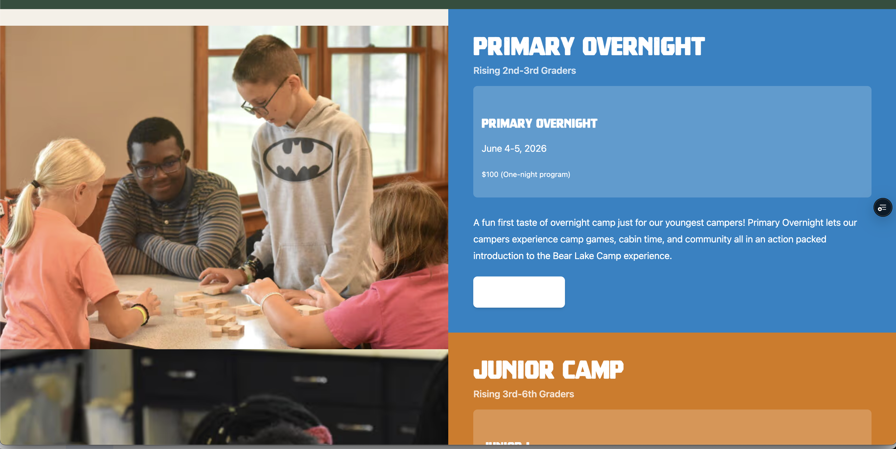
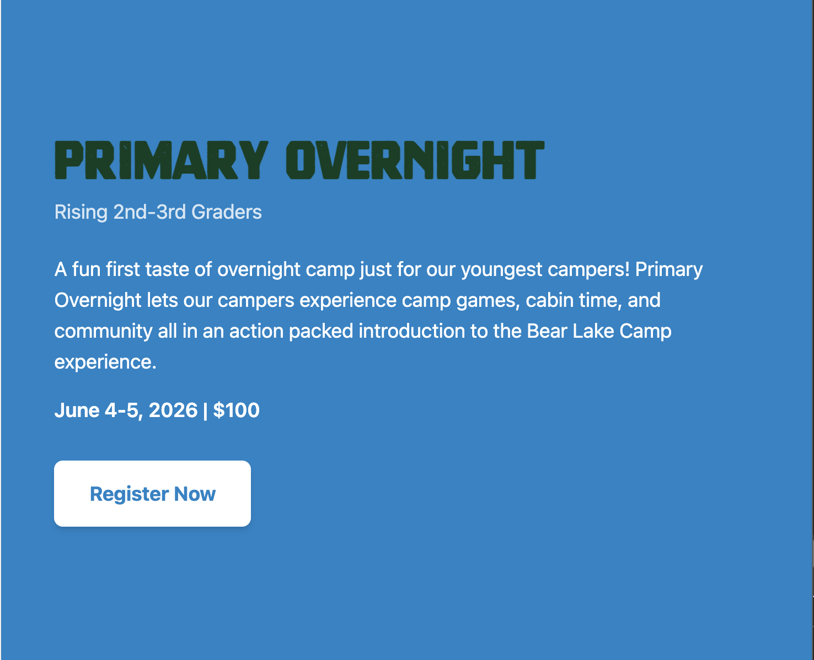
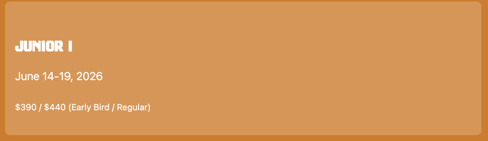
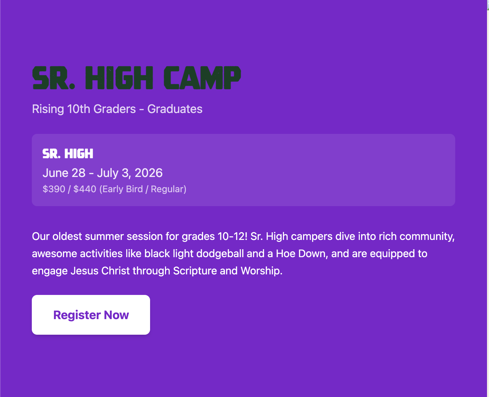
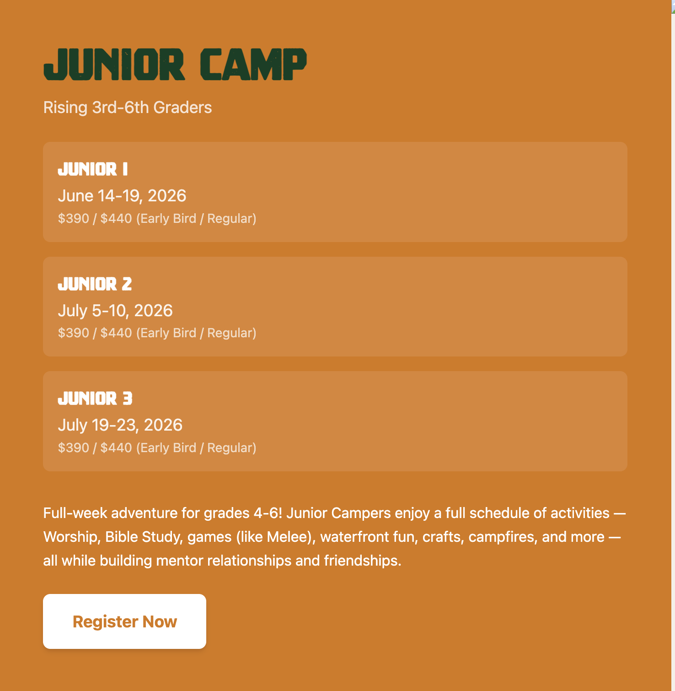
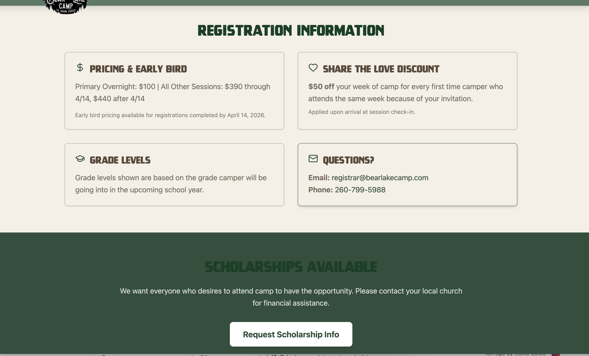
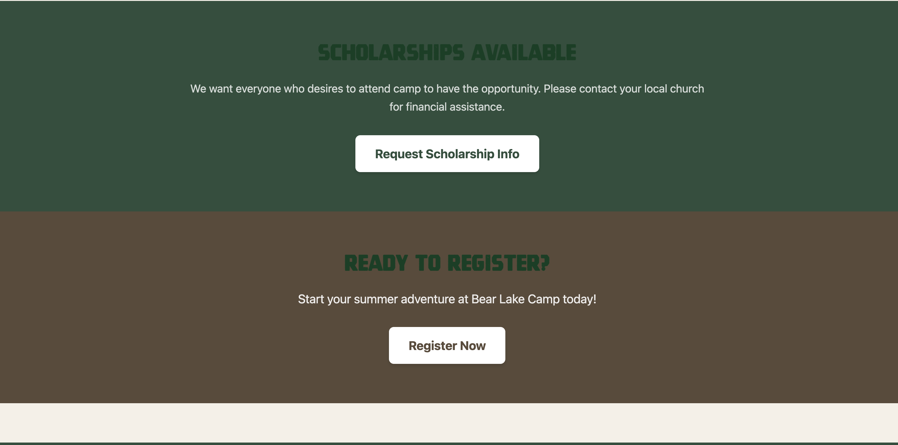
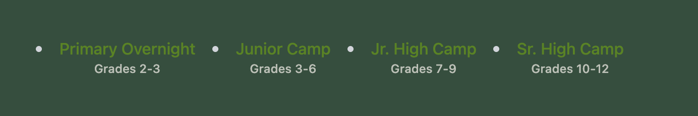
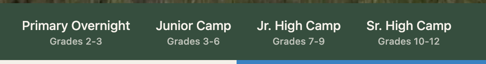

[TS- WE FAILED again]

We totally failed again qplan ('/Users/travis/SparkryDrive/dev/bearlakecamp/requirements/Updates-03.md' look at all of my "[TS-" comments.  You'll note that what we just ran
  failed because so many tests are still incomplete and we had some pretty bad regressions.  I need to see you fully plan this out.  I think the context switch hurt.  You
  need to have plans ready that are context-switch proof.  We should explicitly compact or just launch with new context ensuring that we actively manage our ai context as we
  go from one context window to the next.  )

[TS- I need the team to assess why our dev system keeps failing on these features.  I need the team to analyze all of these deltas and what work was done and why it went wrong.  Separate agents in a separate claude process with separate context need to analyze the findings and peer review them.  They must collaborate on finding a common ground.  This needs to result in a qplan for improving our development system and ultimately our throughput.  I want to be able to provide a set of requriements like this and have them fill in the gaps, ask me questions where the gaps can't be filled well (I don't want stuff made up).  Are we not making the plans small enough?  Is conversation compaction a problem?  Maybe we aren't providing enough up front planning.  We're letting each sub agent go implement how they think without an overarching architecture and design guiding them.  Maybe we have too much preloading context?  Has CLAUDE.md beome bloated and some things should become skills?  Are there better project management approaches we need to consider.]

Huge improvement on https://prelaunch.bearlakecamp.com/summer-camp-sessions

Here are several style changes:
1. The session headings like "Primary Overnight" on desktop need to be white font-size: 3rem; line-height: 1; [TS- The header size didn't change]
1.1. The headers with the text "sessions" can be deleted [TS- Complete]

2. Alternate the row setup: [TS- See screenshot:  Note that the left column is all shifted down, but there is no alternating pattern from one row to the next.][TS-ok]
    HERO
    summercamp jump to nav
    row 1: image | primary overnight
    row 2: Junior Camp | image 
    row 3: image | Jr. High Camp
    row 4: Sr. High Camp | image 

3. New Feature - If I'm logged into github for the CMS, I want a site-strip admin nav at the top.  Black background, white text, same font as BLC nav.  Nav includes links to: CMS (keystatic), deployment status (like in the keystatic nav but smaller and not a button.), report a bug (similar but references the current page on the website with the current url), edit page (opens the page in keystatic ready to edit) 

[TS-Initial implementation completed.  Issues: 
1. edit page goes to this format url: https://prelaunch.bearlakecamp.com/keystatic/collection/pages/about when it should be:  https://prelaunch.bearlakecamp.com/keystatic/branch/main/collection/pages/item/about. 2nd round still not right I was on https://prelaunch.bearlakecamp.com/ and it took me instead to: https://prelaunch.bearlakecamp.com/keystatic/collection/pages/index which was page not found. [TS-ok]
2. This nav should not show in the CMS. The about Page is still broken.  [TS-ok]
3. Report a bug - Can it take a screenshot or copy the current rendered version of the page? Or both for the Report a Bug? I DIDN'T SEE AN ANSWER TO THIS NOR AN UPDATE  This should function the same for both Report a Bug buttons.  Going direct to Github is perfect.] [TS- Can we do a screenshot or copy of the rendered source for the bug?]

4. The "sub-nav" that includes: [TS- fixed]
Primary Overnight
Grades 2-3
Junior Camp
Grades 3-6
Jr. High Camp
Grades 7-9
Sr. High Camp
Grades 10-12

It SHOUND NOT freeze at the top of the page.  It should just scroll up.  

5. The Register Now button should have a white background. [TS-ok]

6. Original Primary Overnight for reference: 
    - I like the size of the header in theimage but the color needs to be white [TS-ok]
    - The header should be left justified [TS-ok]
    - On all headers the age group is just under the header like in this picture [TS-ok]
    - The button text is transparent to the background or matches the grid square color. [TS- OK NOW - The text is currently green. It should match the background color.][TS-This is a regression.  The text on all of these is now white instead of the background color.][TS- Color is correct but we need to remove the underline.]
    - It does not have a "Sessions" text heading above the sessions.  [TS-ok]
    - [TS-NEW Still not fixed] The session sub-cards should be tight like the static-sessions page: . Currently there is way too much space. . There should be no extra space between the lines like in the new image.

7. Original Sr. High Camp: 
    - It has the section in a wide card that is a lighter version of the background color with rounded colors.
    - The header in the card needs to be left justified. [TS-ok]

8. Junior Camp: 
    - Note how there are 3 cards for the sections with one button at the bottom. [TS-ok]

9. Apply 6, 7, 8 as standards for all these content pages.
    - Primary overnight should look very similar to 7 with the card and text. [TS-ok]

10. [TS-New] The text describing the camp should be below the list of sessions. [TS-ok]
[TS-New 10.1 The Register Now button needs a little more padding above it to space it out from this text.] [TS-ok]

11. [TS-New] Please delete summer-camp-junior-high and summer-camp-senior-high.  Ensure these are removed from all tests and scrubbed from the project completely.  They were removed previously but a regression test pass thought they were missing and added them back. [TS-ok]

12. [TS-New] https://prelaunch.bearlakecamp.com/keystatic/branch/main/collection/pages/item/testing-components I get this error on load: Error: Field validation failed: body: Unexpected error: Error: 44:tag has unexpected children 47:tag has unexpected children 50:tag has unexpected children. [TS-still getting] [TS-ok]

13. [TS-New] https://prelaunch.bearlakecamp.com/static-sessions The bottom of this page's template needs to be updated to match the static template version shown here: https://prelaunch.bearlakecamp.com/static-sessions.  All of the components need to be updated below the session like these screenshots and that page:  and .  That's 4 cards for Registration information styled exactly the same as the images. Followed by a Green row for Scholarships Available (Change the heading font color to white for Scholarships Available and make sure the button text is matching green), Followed by a Brown row for Ready to Register (Change the heading font color to white for Ready to Register Available and make sure the button text is matching brown).  [TS-not even close to right. THIS STILL NEEDS WORK]

14. [TS=New] The links to the sessions under the hero should not have bullets.  This is what I see:  and this is what it should be: .  No bullets and white main text for the session name. [TS-ok]

---

## Design Approach Documentation (QDOC)

### General Patterns Applied

#### REQ-U03-FIX-014: Async Build Status Polling
**Problem**: Admin nav strip showed "Building" status but never updated when deployment completed.
**Solution**: Implemented continuous polling with `setInterval` while in Building state:
- Polls every 5 seconds during build
- Auto-stops polling when build completes (Published/Error)
- Maximum poll duration: 10 minutes (prevents infinite polling)
- Uses `useRef` to track interval and start time for proper cleanup

#### REQ-U03-FIX-015: Screenshot Capture for Bug Reports
**Problem**: Bug reports lacked visual context of what the user was seeing.
**Solution**: Integrated html2canvas for screenshot capture:
- Auto-captures screenshot when "Report Bug" modal opens
- Temporarily hides modal during capture for clean screenshot
- Stores as base64 data URL with 50% scale and 70% quality to reduce size
- Preview shown in modal with retake option
- Checkbox to include/exclude screenshot
- Screenshot embedded in GitHub issue using collapsible `
` tag

#### REQ-U03-FIX-016: Full URL in Bug Reports
**Problem**: Bug reports only included relative path (`/about`) instead of full URL.
**Solution**: Updated API route to use `fullUrl` field from context:
- BugReportModal already captured `window.location.href` as `fullUrl`
- API route now prioritizes `fullUrl` over `slug` in issue body
- Provides complete URL (e.g., `https://prelaunch.bearlakecamp.com/about`)

#### CSS Override Pattern for Prose Plugin
**Problem**: Tailwind prose plugin added unwanted styles (underlines, margins).
**Solution**: Use `!important` modifier classes:
- `no-underline` - removes link underlines
- `!m-0` - removes prose margins on headings/paragraphs
- Applied to CTAButton, CtaSection, and InlineSessionCard components

#### Markdoc Boolean Syntax
**Problem**: Keystatic validation failed with `external="true"` (string).
**Solution**: Use Markdoc boolean syntax without quotes or braces:
- Correct: `external=true`
- Incorrect: `external="true"` or `external={true}`
- Same pattern as `allowMultiple=true` in faqAccordion