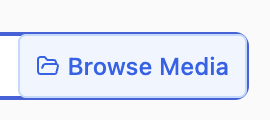
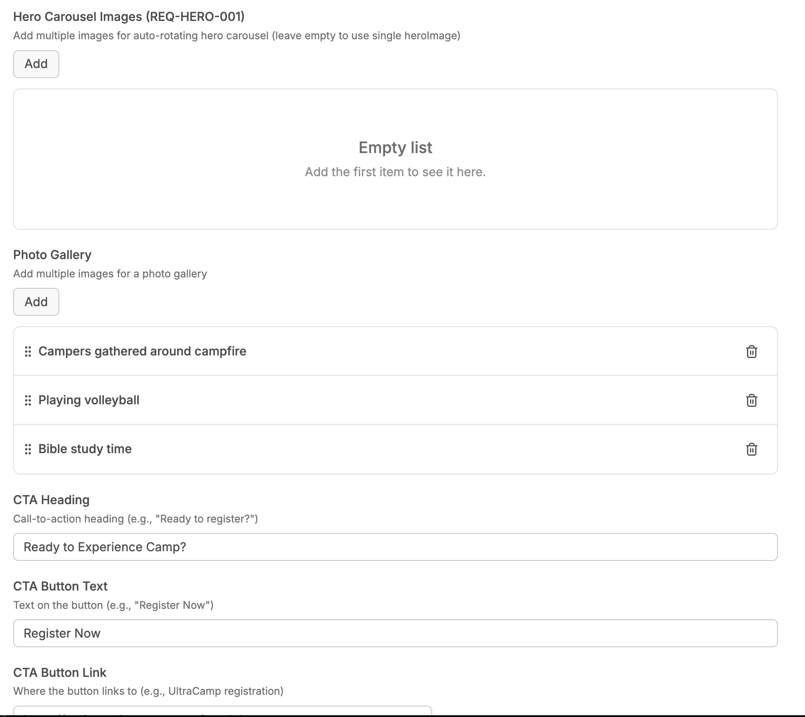
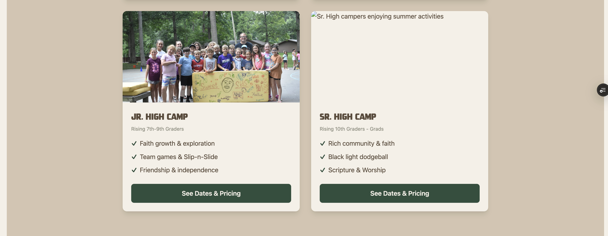
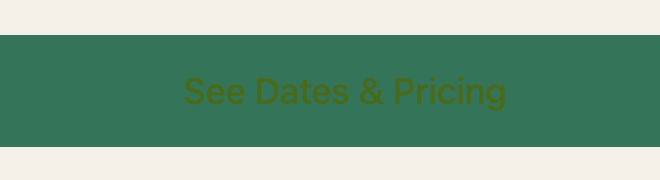
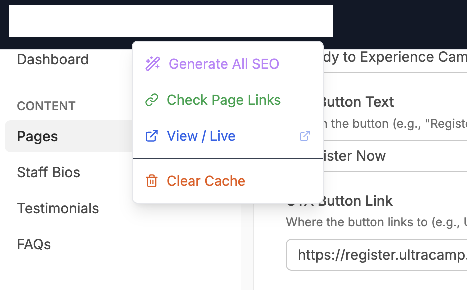

# User Acceptance Testing Plan: Updates-04

**Version**: 1.0 **Date**: 2026-01-06 **Source**: `/requirements/updates-04-detailed.md` **Status**: Ready for UAT

------------------------------------------------------------------------

## Overview

This UAT plan covers all requirements from Updates-04. Each test case maps to a specific REQ-ID and can be executed by a non-technical user in the production environment.

**Production URL**: https://prelaunch.bearlakecamp.com **CMS URL**: https://prelaunch.bearlakecamp.com/keystatic

------------------------------------------------------------------------

## Test Case Summary

| Category      | Test Cases | Priority Coverage   |
|---------------|------------|---------------------|
| Issues        | 3          | P0: 1               |
| Homepage      | 14         | P0: 2, P1: 6, P2: 6 |
| Summer Camp   | 10         | P0: 2, P1: 4, P2: 4 |
| What To Bring | 2          | P2: 2               |
| CMS Features  | 16         | P0: 4, P1: 8, P2: 4 |
| Components    | 2          | P0: 2               |
| **Total**     | **47**     |                     |

------------------------------------------------------------------------

## Issue Test Cases

### UAT-ISSUE-001: Admin Nav Strip Visibility

**REQ-ID**: REQ-ISSUE-001 \| **Priority**: P0

| Step | Action | Expected Result |
|-----------------|------------------|-------------------------------------|
| 1 | Log into CMS via GitHub authentication | Login successful |
| 2 | Navigate to homepage (/) | Admin nav strip appears within 2 seconds |
| 3 | Verify admin nav links | Shows: CMS, Edit Page, Report Bug, Deployment Status |
| 4 | Navigate to /summer-camp | Admin nav persists, Edit Page link updates |
| 5 | Open incognito window, visit homepage | NO admin nav visible (unauthenticated) |

**Pass Criteria**: Admin nav shows for authenticated users only, all links work.

------------------------------------------------------------------------

## Homepage Test Cases

### UAT-HOME-001: CTA Buttons in CMS

**REQ-ID**: REQ-HOME-001 \| **Priority**: P1

| Step | Action | Expected Result |
|-----------------|------------------|-------------------------------------|
| 1 | Open CMS \> Pages \> Homepage | Editor loads |
| 2 | In Page Content, add a CTA Button component | Button appears in editor |
| 3 | Set text: "Learn More", link: /about, variant: primary | Fields update |
| 4 | Save and view homepage | Button renders with correct styling |
| 5 | Click button | Navigates to /about |

**Pass Criteria**: CTA buttons are CMS-editable and render correctly.

\[TS- It is still missing. I'm logged in. This should be easy to see in the Chrome Extension and a screenshot.\]

------------------------------------------------------------------------

### UAT-HOME-002: Gallery Component in CMS

**REQ-ID**: REQ-HOME-002 \| **Priority**: P1

| Step | Action                                | Expected Result                 |
|-----------------|------------------|-------------------------------------|
| 1    | Open CMS \> Pages \> Homepage         | Editor loads                    |
| 2    | Add Gallery component to Page Content | Gallery component appears       |
| 3    | Click image field                     | Media browser opens (per CMS-1) |
| 4    | Select 3 images                       | Images show in gallery preview  |
| 5    | Save and view homepage                | Gallery renders in grid layout  |

**Pass Criteria**: Gallery can be added via CMS with media browser integration.

\[TS-Confirmed\]

------------------------------------------------------------------------

### UAT-HOME-003: Mission Image Preloading

**REQ-ID**: REQ-HOME-003 \| **Priority**: P2

| Step | Action | Expected Result |
|-----------------|------------------|-------------------------------------|
| 1 | Clear browser cache | Cache cleared |
| 2 | Navigate to homepage | Page loads |
| 3 | Observe "Faith. Adventure. Transformation." section | Image loads without requiring scroll |
| 4 | Check Network tab (DevTools) | Image request starts early (not lazy) |

**Pass Criteria**: Mission image loads eagerly, not on scroll.

\[TS-Confirmed\]

------------------------------------------------------------------------

### UAT-HOME-004: Camp Session Card Component

**REQ-ID**: REQ-HOME-004 \| **Priority**: P0

| Step | Action | Expected Result |
|-----------------|------------------|-------------------------------------|
| 1 | Navigate to homepage | Page loads |
| 2 | Scroll to "Which Camp is Right for You?" section | Section visible |
| 3 | Verify card structure | Image, heading, subheading, bullets, CTA button |
| 4 | Check text alignment | All text left-justified within card |
| 5 | Verify bullet style | Checkmarks (or configured style) |
| 6 | Hover over card | Subtle scale/shadow animation |
| 7 | Click "See Dates & Pricing" button | Navigates to session page |

**Pass Criteria**: Cards match design mock, all elements present, animation works.

\[TS-The component looks correct but it isn't in the body of the page in the CMS. I want it stripped from the template and added as page content.\]

------------------------------------------------------------------------

### UAT-HOME-004-CMS: Camp Session Card CMS Editing

**REQ-ID**: REQ-HOME-004 \| **Priority**: P0

| Step | Action                               | Expected Result                |
|------|--------------------------------------|--------------------------------|
| 1    | Open CMS \> Pages \> Homepage        | Editor loads                   |
| 2    | Find/add Camp Session Card component | Component available            |
| 3    | Set image via media browser          | Image selected                 |
| 4    | Set heading: "Test Camp"             | Field updates                  |
| 5    | Set subheading: "Ages 10-12"         | Field updates                  |
| 6    | Select bullet type: Diamond          | Preview shows diamond bullets  |
| 7    | Add 3 bullets                        | Bullets appear                 |
| 8    | Set CTA text and link                | Fields update                  |
| 9    | Save and view                        | Card renders with all settings |

**Pass Criteria**: All card fields editable in CMS with live preview.

\[TS- Functionality mostly works. Issues: 1. The Media Browser button doesn't show until the user puts the cursor in the field. 2. The Media Browser button doesn't fit well into the text fields here and throughout the experience.  It needs not overlap the text field border\]

\[TS- Related we need all of these section of the CMS editor for the index page removed. These are not needed

\]

------------------------------------------------------------------------

### UAT-HOME-005: Work At Camp Section

**REQ-ID**: REQ-HOME-005 \| **Priority**: P1

| Step | Action | Expected Result |
|-----------------|------------------|-------------------------------------|
| 1 | Navigate to homepage | Page loads |
| 2 | Scroll to "Work At Camp" section | Section visible |
| 3 | Verify 3 opportunities shown | Summer Staff, LIT, Year-Round |
| 4 | Verify visual style | Different from session cards |
| 5 | Click "Summer Staff" link | Navigates to /work-at-camp-summer-staff |
| 6 | Click "Leaders in Training" link | Navigates to /work-at-camp-leaders-in-training |
| 7 | Click "Year-Round" link | Navigates to /work-at-camp-year-round |

**Pass Criteria**: Section shows 3 work opportunities with working links.

\[TS- Failed Not on the home page nor in the CMS body\]

------------------------------------------------------------------------

### UAT-HOME-006: Wide Card Component

**REQ-ID**: REQ-HOME-006 \| **Priority**: P1

| Step | Action                 | Expected Result                     |
|------|------------------------|-------------------------------------|
| 1    | Navigate to homepage   | Page loads                          |
| 2    | Find Retreats section  | Wide card visible                   |
| 3    | Verify layout          | Image on one side, content on other |
| 4    | Check background color | Has configured background           |
| 5    | Resize to mobile       | Card stacks vertically              |

**Pass Criteria**: Wide card renders with configurable layout and is responsive.

\[TS- Failed Not on the home page nor in the CMS body\]

------------------------------------------------------------------------

### UAT-HOME-007: Retreats Section

**REQ-ID**: REQ-HOME-007 \| **Priority**: P2

| Step | Action                       | Expected Result                    |
|------|------------------------------|------------------------------------|
| 1    | Navigate to homepage         | Page loads                         |
| 2    | Find Retreats section        | Section visible below Work At Camp |
| 3    | Verify uses wide card format | Wide card with image               |
| 4    | Click CTA                    | Navigates to /retreats             |

**Pass Criteria**: Retreats section present with link to retreats page.

\[TS- Failed Not on the home page nor in the CMS\]

------------------------------------------------------------------------

### UAT-HOME-008: Rentals Section

**REQ-ID**: REQ-HOME-008 \| **Priority**: P2

| Step | Action                               | Expected Result                |
|------|--------------------------------------|--------------------------------|
| 1    | Navigate to homepage                 | Page loads                     |
| 2    | Find Rentals section                 | Section visible below Retreats |
| 3    | Verify different color than Retreats | Distinct background color      |
| 4    | Click CTA                            | Navigates to /rentals          |

**Pass Criteria**: Rentals section present with different styling than Retreats.

\[TS- Failed Not on the home page nor in the CMS\]

------------------------------------------------------------------------

## Summer Camp Page Test Cases

### UAT-SUMMER-001: YouTube Hero Video

**REQ-ID**: REQ-SUMMER-001 \| **Priority**: P1

| Step | Action                           | Expected Result             |
|------|----------------------------------|-----------------------------|
| 1    | Navigate to /summer-camp         | Page loads                  |
| 2    | Observe hero section             | YouTube video plays (muted) |
| 3    | Block YouTube (ad blocker)       | Fallback hero image shows   |
| 4    | Open CMS \> Pages \> summer-camp | Editor loads                |
| 5    | Find hero YouTube ID field       | Field shows video ID        |

**Pass Criteria**: YouTube hero plays or gracefully falls back to image.

\[TS-Confirmed\]

------------------------------------------------------------------------

### UAT-SUMMER-002: Worthy Section Width

**REQ-ID**: REQ-SUMMER-002 \| **Priority**: P2

| Step | Action                            | Expected Result            |
|------|-----------------------------------|----------------------------|
| 1    | Navigate to /summer-camp          | Page loads                 |
| 2    | Find "Summer 2026 Worthy" section | Section visible            |
| 3    | Open CMS, edit section card       | Width options available    |
| 4    | Set width to 75%                  | Preview updates            |
| 5    | Save and view                     | Card centered at 75% width |

**Pass Criteria**: Section width configurable via CMS.

\[TS-Confirmed\]

------------------------------------------------------------------------

### UAT-SUMMER-003: Session Cards on Summer Camp

**REQ-ID**: REQ-SUMMER-003 \| **Priority**: P0

| Step | Action                               | Expected Result       |
|------|--------------------------------------|-----------------------|
| 1    | Navigate to /summer-camp             | Page loads            |
| 2    | Find camp sessions section           | Session cards visible |
| 3    | Verify same style as homepage cards  | Matching design       |
| 4    | Verify content matches sessions page | Same camp info        |

**Pass Criteria**: Session cards identical to homepage cards.

\[TS-Confirmed but styling issues. The cards are supposed to have rounded corners but are square. The cards are going full width like this: 

Needs to be like this: Also the button needs white text. Currently: \]

------------------------------------------------------------------------

### UAT-SUMMER-004: Prepare For Camp Card Width

**REQ-ID**: REQ-SUMMER-004 \| **Priority**: P2

| Step | Action                          | Expected Result         |
|------|---------------------------------|-------------------------|
| 1    | Navigate to /summer-camp        | Page loads              |
| 2    | Find "Prepare For Camp" section | Cards visible           |
| 3    | Observe card width              | \~60% of original width |
| 4    | Verify centered                 | Cards are centered      |

**Pass Criteria**: Prepare For Camp cards are narrower than before.

\[TS-Confirmed\]

------------------------------------------------------------------------

### UAT-SUMMER-005: Prepare For Camp Icon Size

**REQ-ID**: REQ-SUMMER-005 \| **Priority**: P2

| Step | Action                          | Expected Result               |
|------|---------------------------------|-------------------------------|
| 1    | Navigate to /summer-camp        | Page loads                    |
| 2    | Find "Prepare For Camp" section | Icons visible                 |
| 3    | Observe icon size               | Icons are larger than default |
| 4    | Open CMS, edit icon size        | Size options available        |

**Pass Criteria**: Icons are configurable and larger by default.

\[TS-Confirmed\]

------------------------------------------------------------------------

### UAT-SUMMER-006: Prepare For Camp Button Links

**REQ-ID**: REQ-SUMMER-006 \| **Priority**: P1

| Step | Action                          | Expected Result               |
|------|---------------------------------|-------------------------------|
| 1    | Navigate to /summer-camp        | Page loads                    |
| 2    | Find "Prepare For Camp" section | Section visible               |
| 3    | Find links at bottom of cards   | Links styled as buttons       |
| 4    | Verify button centering         | Buttons horizontally centered |
| 5    | Click button                    | Navigates correctly           |

**Pass Criteria**: Links are button-styled and centered.\
\
\[TS- The buttons are not centered. They need a little more space above them. The space between the heading and the text needs to be less. The heading needs to be one size bigger. \]

------------------------------------------------------------------------

## What To Bring Page Test Cases

### UAT-BRING-001: Hero Image Height

**REQ-ID**: REQ-BRING-001 \| **Priority**: P2

| Step | Action | Expected Result |
|----|----|----|
| 1 | Navigate to /summer-camp-what-to-bring | Page loads |
| 2 | Observe hero image | Full subjects visible (no head cutoff) |
| 3 | Measure hero height | At least 400px tall |
| 4 | Open CMS, check hero height option | Height configurable |

**Pass Criteria**: Hero shows complete image without awkward cropping.

\[TS- the image is still getting cut off.\]

------------------------------------------------------------------------

## CMS Feature Test Cases

### UAT-CMS-001: Media Browser with Upload

**REQ-ID**: REQ-CMS-001 \| **Priority**: P0

| Step | Action                        | Expected Result               |
|------|-------------------------------|-------------------------------|
| 1    | Open CMS \> Pages \> any page | Editor loads                  |
| 2    | Click any image field         | Media browser modal opens     |
| 3    | Verify image sorting          | Newest images first           |
| 4    | Click "Upload" button         | File picker opens             |
| 5    | Drag image to browser         | Image uploads                 |
| 6    | Select newly uploaded image   | Field populates, modal closes |
| 7    | Upload file \>5MB             | Error: "File too large"       |

**Pass Criteria**: Media browser works with upload, sorted by date.

\[TS- Fail. I got Upload failed and this console error: layout-759b503e7716cfae.js:1 \[usePageContent\] Body element appeared, extracting... layout-759b503e7716cfae.js:1 \[usePageContent\] Extracted: {slug: 'index', title: 'Index', bodyLength: 663, bodyPreview: 'Camp Session CardsEditWelcome to Bear Lake CampBea'} layout-759b503e7716cfae.js:1 \[usePageContent\] Body element appeared, extracting... layout-759b503e7716cfae.js:1 \[usePageContent\] Extracted: {slug: 'index', title: 'Index', bodyLength: 663, bodyPreview: 'Camp Session CardsEditWelcome to Bear Lake CampBea'} layout-759b503e7716cfae.js:1 \[usePageContent\] Body element appeared, extracting... layout-759b503e7716cfae.js:1 \[usePageContent\] Extracted: {slug: 'index', title: 'Index', bodyLength: 663, bodyPreview: 'Camp Session CardsEditWelcome to Bear Lake CampBea'} layout-759b503e7716cfae.js:1 POST <https://prelaunch.bearlakecamp.com/api/media> 500 (Internal Server Error) (anonymous) \@ layout-759b503e7716cfae.js:1 P \@ 643-26db354db8561efc.js:1 a\_ \@ e380800c-6bebc427deead5ce.js:1 aR \@ e380800c-6bebc427deead5ce.js:1 (anonymous) \@ e380800c-6bebc427deead5ce.js:1 sF \@ e380800c-6bebc427deead5ce.js:1 sM \@ e380800c-6bebc427deead5ce.js:1 (anonymous) \@ e380800c-6bebc427deead5ce.js:1 o4 \@ e380800c-6bebc427deead5ce.js:1 iV \@ e380800c-6bebc427deead5ce.js:1 sU \@ e380800c-6bebc427deead5ce.js:1 uR \@ e380800c-6bebc427deead5ce.js:1 uM \@ e380800c-6bebc427deead5ce.js:1 layout-759b503e7716cfae.js:1 \[usePageContent\] Body element appeared, extracting... layout-759b503e7716cfae.js:1 \[usePageContent\] Extracted: {slug: 'index', title: 'Index', bodyLength: 663, bodyPreview: 'Camp Session CardsEditWelcome to Bear Lake CampBea'} \]

------------------------------------------------------------------------

### UAT-CMS-002: Component Deduplication

**REQ-ID**: REQ-CMS-002 \| **Priority**: P1

| Step | Action                         | Expected Result                  |
|------|--------------------------------|----------------------------------|
| 1    | Open CMS component list        | List shows available components  |
| 2    | Check for duplicate components | No obvious duplicates            |
| 3    | Add each similar component     | Each has distinct purpose        |
| 4    | View existing pages            | No deprecated component warnings |

**Pass Criteria**: Component list is clean without confusing duplicates.

\[TS- Confirmed\]

------------------------------------------------------------------------

### UAT-CMS-003: Container Width/Height/Background

**REQ-ID**: REQ-CMS-003 \| **Priority**: P0

| Step | Action | Expected Result |
|----|----|----|
| 1 | Open CMS, add Section component | Component appears |
| 2 | Find width dropdown | Options: Auto, 25%, 50%, 75%, 100%, Custom |
| 3 | Set width to 50% | Preview updates |
| 4 | Find height dropdown | Options available |
| 5 | Set background color | Color picker opens |
| 6 | Enter hex value | Preview shows color |
| 7 | Set background image | Image picker opens |
| 8 | Save and view | All settings applied |

**Pass Criteria**: Container components have width, height, background options.

\[TS- Confirmed\]

------------------------------------------------------------------------

### UAT-CMS-004: Icon Size Settings

**REQ-ID**: REQ-CMS-004 \| **Priority**: P1

| Step | Action                            | Expected Result                   |
|------|-----------------------------------|-----------------------------------|
| 1    | Open CMS, add component with icon | Component appears                 |
| 2    | Find icon size dropdown           | Options: Small, Medium, Large, XL |
| 3    | Select "Extra Large"              | Preview shows larger icon         |
| 4    | Save and view                     | Icon renders at 48px              |

**Pass Criteria**: Icon sizes are configurable with preview.

\[TS- Confirmed\]

------------------------------------------------------------------------

### UAT-CMS-005: Color Picker with Presets

**REQ-ID**: REQ-CMS-005 \| **Priority**: P1

| Step | Action | Expected Result |
|-----------------|------------------|-------------------------------------|
| 1 | Open CMS, find color field | Color picker appears on click |
| 2 | Verify theme color presets | Shows: Emerald, Sky Blue, Amber, Purple, Cream, Bark |
| 3 | Click theme color | Hex field updates, preview updates |
| 4 | Verify standard web colors | Grid of common colors |
| 5 | Enter hex: #ff0000 | Preview turns red |
| 6 | Enter invalid hex | Validation error shown |

**Pass Criteria**: Color picker has presets, hex input, and live preview.

\[TS- Every color selector is different.\]

------------------------------------------------------------------------

### UAT-CMS-006: UX Review

**REQ-ID**: REQ-CMS-006 \| **Priority**: P2

| Step | Action                  | Expected Result          |
|------|-------------------------|--------------------------|
| 1    | Review all CMS features | Usability check complete |
| 2    | Document findings       | Findings documented      |
| 3    | Check accessibility     | A11y requirements met    |

**Pass Criteria**: UX expert has reviewed and documented findings.

------------------------------------------------------------------------

### UAT-CMS-007: Navigation Updates

**REQ-ID**: REQ-CMS-007 \| **Priority**: P1 (Implemented)

| Step | Action | Expected Result |
|-----------------|------------------|-------------------------------------|
| 1 | Open CMS (/keystatic) | CMS dashboard loads |
| 2 | Observe top navigation bar | Black background, white text |
| 3 | Verify dropdown menus | Content, Tools, Help dropdowns |
| 4 | Click "Content" dropdown | Shows: All Pages, Media Library, Sort by Recent |
| 5 | Click "Tools" dropdown | Shows: Generate All SEO, Check Page Links, Clear Cache |
| 6 | Click "Help" dropdown | Shows: Report Issue, View Live |
| 7 | Locate dark mode toggle | In nav bar |
| 8 | Toggle dark/light mode | Theme switches correctly |

**Pass Criteria**: Black/white nav with organized dropdowns and dark mode toggle.

\[TS- Stays light after changing. No dark mode. Plus our menu items in the navigation are white on white 

------------------------------------------------------------------------

### UAT-CMS-008: Light/Dark Mode Fix

**REQ-ID**: REQ-CMS-008 \| **Priority**: P1

| Step | Action                         | Expected Result            |
|------|--------------------------------|----------------------------|
| 1    | Open CMS                       | Default theme loads        |
| 2    | Toggle to Light mode           | All backgrounds turn light |
| 3    | Check sidebar                  | Light colored              |
| 4    | Check main content area        | Light colored              |
| 5    | Open component editor popup    | Popup has light background |
| 6    | Refresh page                   | Light mode persists        |
| 7    | Navigate to different CMS page | Theme consistent           |

**Pass Criteria**: Light mode works across all CMS elements including popups.

\[TS-Failed see above\]

------------------------------------------------------------------------

## Component Test Cases

### UAT-COMP-001: Camp Session Card Container

**REQ-ID**: REQ-COMP-001 \| **Priority**: P0

| Step | Action                         | Expected Result           |
|------|--------------------------------|---------------------------|
| 1    | View session cards on desktop  | 4-column grid             |
| 2    | Resize to tablet               | 2-3 column grid           |
| 3    | Resize to mobile               | 1-column stack            |
| 4    | Verify equal height cards      | Cards same height per row |
| 5    | Open CMS, check columns option | 2, 3, or 4 column options |
| 6    | Check gap option               | Small, Medium, Large gaps |

**Pass Criteria**: Card grid is responsive with configurable columns and gap.

------------------------------------------------------------------------

## Test Execution Checklist

### Pre-Testing

-   [ ] Clear browser cache
-   [ ] Log into CMS with GitHub
-   [ ] Open DevTools Network tab
-   [ ] Have screenshot tool ready

### During Testing

-   [ ] Document any failures with screenshots
-   [ ] Note browser/device tested
-   [ ] Time any performance-related tests

### Post-Testing

-   [ ] Compile test results
-   [ ] File bugs for any failures
-   [ ] Update requirement status

------------------------------------------------------------------------

## Sign-Off

| Role          | Name | Date | Signature |
|---------------|------|------|-----------|
| Tester        |      |      |           |
| Product Owner |      |      |           |
| Dev Lead      |      |      |           |

------------------------------------------------------------------------

## Revision History

| Version | Date       | Changes                                      |
|---------|------------|----------------------------------------------|
| 1.0     | 2026-01-06 | Initial UAT plan from updates-04-detailed.md |