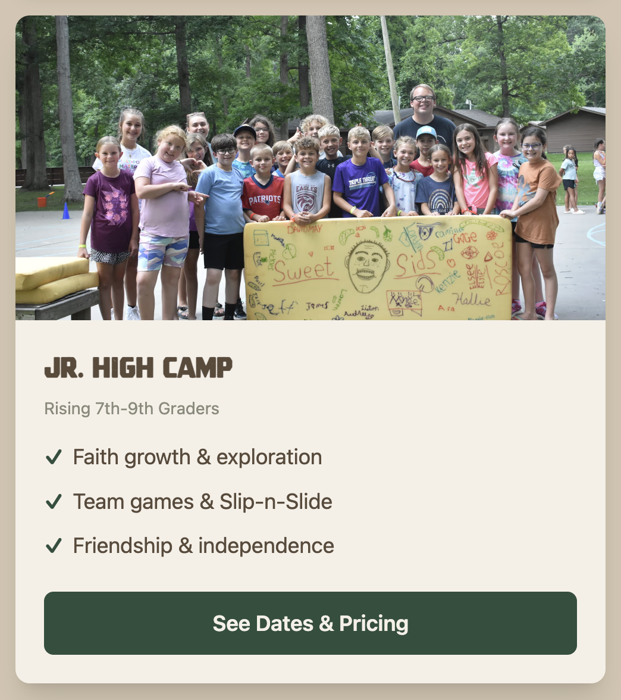

# Common Contraints across all requirements & Issues
1. Ensure all tests at all levels are scrubbed and updated to match these new requirements first.  This includes all unit, system, integration, and smoke tests.  You'll want to do advanced finds and greps or whatever is needed to fully update these.
2. Changes will involve both how the pages display and how they are edited in the CMS.  We need to ensure that our requirements and designs fully consider this.  Specifically, the flow should be: 1. Update components. 2. Update CMS to support those components. 3. Update the website to build/render those components 4. Test using one of our production test pages opened using the Chrome Extension and modified through the UI. 5. Confirm all rendering in production with the Chrome Extension
3. 

# Issues
1. The admin nav on the main site keeps disappearing.  It is currently not rendering.  

# New Requirements
We have a few redesign things to address across multiple pages.  These are grouped by page on the website.
1. https://prelaunch.bearlakecamp.com/
1.1. The current home page CMS template doesn't have all of its compontents included in the CMS editor.  Specifically, we now have CTA buttons and Gallery components that can be added to the Page Content.  Currently, these are hardcoded mandatory components included in the homepage template.  
The Faith. Adventure. Transformation. section - The image for this section always seems to be the last to load.  OR that it doesn't load until the page starts scrolling.  It should preload after the video loads.
1.2 Updated Content sections no the page:
- Hero video (unchanged)
- Facts (unchanged)
- Our Mission (text - unchanged; picture - the campfire picture)
- Which Camp is right for you? 
    -- This needs to probably create a new CMS component to add to the page.  Although, we may already have one. 
    -- Mock: 
    -- Rounded Corners Card with animate on hover
    -- image at the top (use the matching images that we have in the sections of the summer-camp-sessions page)
    -- Text Section
        - All Left Justified (all text needs to match  what's on the corresponding summer-camp-sessions page)
        - Heading (with Camp Week Title like Jr. High Camp)
        - Subheading (smaller text not bold with age group like Rising 7th-9th Graders)
        - 1-5 Bullets with choices of bullet type for the group (checkmark, bullet, diamond, numbers, open to other ideas or icons)
        - "See Dates & Pricing" button (green with white text - centered)
- Work At Camp (new section
    -- Using the content from the following pages, create a section that highlights and links to these 3 areas.  Not like the Which Camp Is Right For You Cards, though. https://prelaunch.bearlakecamp.com/work-at-camp-summer-staff, https://prelaunch.bearlakecamp.com/work-at-camp-leaders-in-training, https://prelaunch.bearlakecamp.com/work-at-camp-year-round)
- Retreats
    -- Using the content from https://prelaunch.bearlakecamp.com/retreats create a section that highlights retreats and links to this page.  Not just text.  A wide card of some sort.  
- Rentals
    -- Using the content from https://prelaunch.bearlakecamp.com/rentals create a section that highlights rentals and links to this page.  Not just text.  A wide card of some sort but different in color from Retreats. 
2. https://prelaunch.bearlakecamp.com/summer-camp
2.1 Hero:  Copy or Update the Video Hero component so that we support YouTube hero videos.  Then update this page to use the Worthy Summer 2026 Youtub video already on the page.
2.2 Summer 2026 Worthy Section Card (text unchanged - card needs the CMS-3 below so that we can adjust the card width )
2.3 Summer Camp Sessions - This should be an exact copy of 1.2 Which Camp is right for you? 
2.4 Prepare For Camp (text ok)
    - Needs CMS-3 and then update the width of these cards so they are about 60$ their current width.
    - Needs CMS-4 and then make the icons bigger
    - The links at the bottom need to be buttons and centered
3. https://prelaunch.bearlakecamp.com/summer-camp-what-to-bring
2.1 Hero - The hero image area needs to be bigger.  We're currently cutting off the heads of people in the image.
2.2 

# We also have CMS Feature Changes

## Constraint Requirements
a. The team needs to consider all the likely use case variations for these different components. We then need to ensure we build Playwright tests that validate these use cases work in production on test pages.  For all changed requirements scrub all existing tests as noted above to ensure we do not regress back to the existing experience. Consider scenarios where components get nested within each other.
b. All components must be as visual as we can make them.  Our users are not techie.
c. All requirements are really just epics - I expect the team to debate these like a product and dev team coming up with full product requirements for these CMS features like we're a professional dev team.  This includes the creation of all the possible use cases for our components to consider.  Happy path, error path, fat finger path, unexpected user paths.  Then, you can dive into the QPLAN planning.

## New Requirements
CMS-1 We need to audit all of the components that can be added in the editor.  If they include the ability to add an image it should open our media browser.  The user should have the option of uploading new images directly there in the media browser via a button.  They can choose either existing images in our media browser or the newly added image.  The image sorting should be based on most recently added.  

CMS-2 I need the team to audit all of our components that we've built for the editor.  It looks like we have some duplicates.  Refactor into a smaller set that includes the complete suite of features.  Be sure to update all pages to uses the updated components.

CMS-3 I want to refactor all Page Content Card, Card Grid, Grid, Section, (etc. anything like these that contain stuff) components to include width and height options. We should also be able to set the background color or image for the container in the CMS.  Follow CMS-5 rules

CMS-4 I want to refactor all icons in components to also include a size setting. 

CMS-5 Refactor all elements that include color selection.  We should have preset colors that match our theme but also the ability to enter any hex value.  The selected color should update a preview square in the componenet editor so the user can see what color has been selected. Also, a grid of standard web colors as an option as well.

CMS-6 Have our usability expert review our CMS components after the above are complete and recommend any additional UX improvements planned to the same level of detail that we end up planning CMS-1-5.

CMS-7 Change the CMS nav to have a black and white style.  Black background white text.  Keep the buttons with icons.  Have our UX designer and usability expert review this and expand it to have proper CX for a CMS like this.  I want standard naming that non-techie users understand.  I think having a menu with drop downs might help organize things.  We should move the dark mode switch to this nav.

CMS-8 Our Light Mode / Dark Mode isn't working again in the CMS.  Dark mode looks correct across the board.  Not everything turns light when switched.  Be sure that you confirm that component editing pop ups also switch.  The last time we weren't doing it through keystatic's common system.